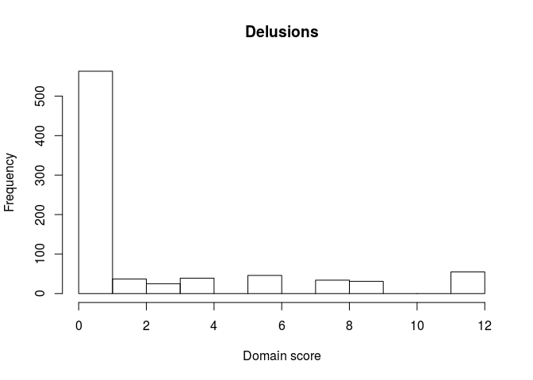
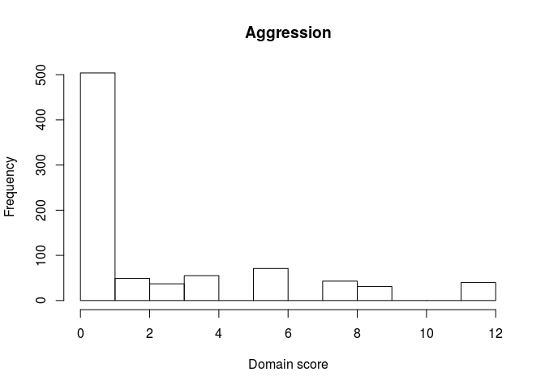
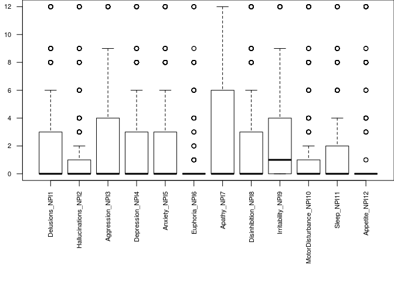
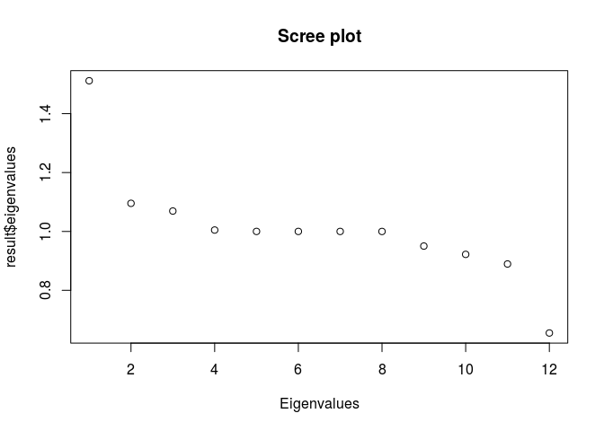
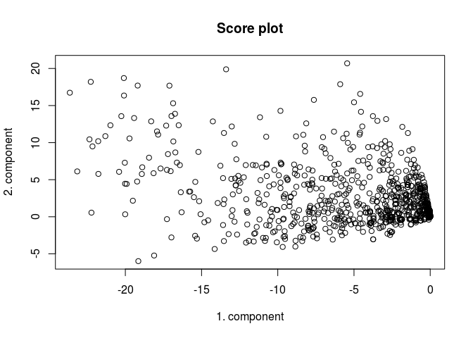

<!-- README.md is generated from README.Rmd. Please edit that file -->
<!-- usethis::use_readme_rmd() og så Ctlr + Shift + K -->
ZIBP-PCA: Zero-inflated Bivariate Poisson Principal Component analysis
======================================================================

This vignette describes how to use the R package zibppca to perform Zero-inflated Bivariate Poisson Principal Component analysis for Neuro-Psychiatric Inventory (NPI) items.

Installation
============

You can install the R package *zibppca* directly from GitHub, after installing the package devtools. The help description files can be accessed by using ?

``` r

#Install and load the devtools package
install.packages("devtools")
library(devtools)

# Install the zibppca package directly from GitHub
install_github("khellton/zibppca")

#Load the zibppca package
library(zibppca)

#Check the help file
?zibppca
```

Analyzing NPI items
===================

First, load the NPI data either from SPSS or csv file and create a data.frame. Then the first 10 patients should look something like this:

    #>    Delusions_NPI1 Hallucinations_NPI2 Aggression_NPI3 Depression_NPI4
    #> 1               0                   0               0               6
    #> 2               0                   0               0               0
    #> 3               6                   0               2               0
    #> 4               0                   0               0               0
    #> 5               4                   0               0               4
    #> 6               0                   0               0               0
    #> 7               0                   0               0               0
    #> 8              12                   0               3               0
    #> 9               0                   0               0              12
    #> 10              8                   6               8               0
    #>    Anxiety_NPI5 Euphoria_NPI6 Apathy_NPI7 Disinhibition_NPI8
    #> 1             2             6           6                 12
    #> 2             0             0           8                  0
    #> 3             0             8           0                  6
    #> 4             0             8           0                  8
    #> 5             0             0           8                  0
    #> 6             0             6           8                  8
    #> 7             3             0          12                  0
    #> 8             0             0           0                  0
    #> 9             0             0          12                  4
    #> 10            0             0           9                 12
    #>    Irritability_NPI9 MotorDisturbance_NPI10 Sleep_NPI11 Appetite_NPI12
    #> 1                  0                      1           0              0
    #> 2                  0                      0           0              0
    #> 3                  6                      0          12              0
    #> 4                  0                      4           9              0
    #> 5                  0                      0           0              4
    #> 6                  0                      8           0             12
    #> 7                  0                      0           0              4
    #> 8                  8                      0           0              0
    #> 9                  1                      0           0              3
    #> 10                 6                     12          12              0

The distribution of the different items can be visually inspected by histograms, or clustered box plots, for instance as seen below for Delusions and Aggression.



Principal component analysis
============================

The *zibppca* package has the following outline

``` r
library(zibppca)
#Run the main command 
result <- zibppca(data,scale. = TRUE)
#> [1] "Analyzing data with 12 variables and 830 observations"

### Loadings of the first 3 components
result$loadings[,1:3]
#>                                 [,1]          [,2]          [,3]
#> Delusions_NPI1         -0.2622601240  0.4821305118 -0.3798866955
#> Hallucinations_NPI2    -0.1082992701  0.5120023629 -0.5008639915
#> Aggression_NPI3        -0.6164949410 -0.1098594931  0.0080981797
#> Depression_NPI4        -0.0423469611  0.4352356548  0.5584055258
#> Anxiety_NPI5           -0.0782833592  0.4634346828  0.5067744951
#> Euphoria_NPI6          -0.0124559932 -0.0488332654  0.0351436861
#> Apathy_NPI7            -0.0018804366  0.0633776167  0.1126235691
#> Disinhibition_NPI8     -0.3117465700 -0.2535016300  0.1336287956
#> Irritability_NPI9      -0.6588558291 -0.1354960146  0.0655665155
#> MotorDisturbance_NPI10 -0.0081733914 -0.0104434701  0.0066161937
#> Sleep_NPI11            -0.0009260809 -0.0003347656  0.0002063836
#> Appetite_NPI12         -0.0002378082 -0.0001637063  0.0002709173

### Scree plot of eigenvalues
result$eigenvalues 
#>  [1] 1.5116877 1.0954316 1.0692296 1.0046937 1.0000139 0.9999985 0.9999799
#>  [8] 0.9998962 0.9502895 0.9220619 0.8894493 0.6550727
plot(result$eigenvalues,main = 'Scree plot',xlab='Eigenvalues')
```



``` r

### Plot patient scores 
plot(result$scores[,1],result$scores[,2],main = 'Score plot',xlab='1. component',ylab='2. component')
```


